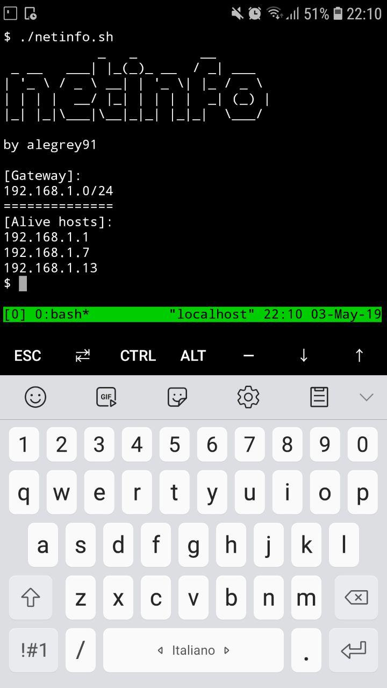

# PubPwn 
A simple wrapper to easly pwn connected devices (at your favourite Pub) from your smartphone XD</br>

Introduction
Often, when you are alone in the pub, you need to waste your time somehow.</br>
The idea was born few months ago, when I was really bored, in front of a pint of beer.</br>
The reason why I decided to create this repo is that: pwn from your smartphone is very hard!</br> 
The output is really unreadable and write commands is not so easy.</br>
For this reason I decide to automize the information gathering process using this script.</br>
N.B. they just are wrapper for other tools, nothing really special.</br>


As you can see, you have an easy interface to check alive hosts and scan their open ports.

Requirements
Befor to start to use this script, you need to install on your smartphone:
* termux (https://play.google.com/store/apps/details?id=com.termux&hl=it)
* nmap (```pkg install nmap```)

Startup
Just ```./netinfo.sh``` from your terminal emulator
